# beam-agents

**An agent is a Beam transform.**

`beam-agents` makes AI agents first-class citizens of Apache Beam streaming
pipelines — a keyed, stateful, fault-tolerant runtime (`events |
RunAgent(my_agent)`), **not** an agent-authoring framework. It is built for
**system-triggered** workloads: fraud triage, anomaly response,
personalization, IoT reaction, ops automation. Events invoke the agent; its
decisions are durable, replayable, and horizontally scalable. It is not built
for sub-second interactive chat.

`v1.0.0a1` · pre-release, not yet on PyPI · Apache-2.0 · Python 3.11–3.12

| Where | What |
|---|---|
| **Documentation** | <https://ardada2468.github.io/beam-agents/> — the rendered [`docs/`](docs/) tree plus seven runnable example programs ([`examples/`](examples/)). Build locally with `make docs`, browse with `make docs-serve`. |
| **Documentation site** | [`website/`](website/) — run it with `make site-dev`. Its content is verified against this repository on every change; see [`website/README.md`](website/README.md). |
| **Architecture & principles** | [`openspec/project.md`](openspec/project.md) |

Every figure below is the same drawing those two sites show, lifted verbatim
from them by [`scripts/gen_readme_diagrams.py`](scripts/gen_readme_diagrams.py)
and re-emitted into [`docs/assets/diagrams/`](docs/assets/diagrams) as a
standalone file per theme, because GitHub strips inline SVG. Nothing here is
re-drawn by hand, so a figure that changes on either site changes here too.

## Contents

- [A runtime, not a framework](#a-runtime-not-a-framework)
- [The shape of an activation](#the-shape-of-an-activation)
- [The shape of a pipeline](#the-shape-of-a-pipeline)
- [Hello, world](#hello-world)
- [The four outputs](#the-four-outputs)
- [Two paths through `RunAgent`](#two-paths-through-runagent)
- [Inside the stateful `DoFn`](#inside-the-stateful-dofn)
- [Running the effector](#running-the-effector)
- [Human-in-the-loop](#human-in-the-loop)
- [Errors and dead letters](#errors-and-dead-letters)
- [The correctness invariants](#the-correctness-invariants)
- [Traces and metrics](#traces-and-metrics)
- [Hot keys and sharding](#hot-keys-and-sharding)
- [Continuous evaluation](#continuous-evaluation)
- [Configuring a pipeline](#configuring-a-pipeline)
- [Model providers](#model-providers)
- [Framework adapters](#framework-adapters)
- [Runners](#runners)
- [Guarantees, and the gates that enforce them](#guarantees-and-the-gates-that-enforce-them)
- [Bootstrap](#bootstrap)
- [See it run: the console](#see-it-run-the-console)
- [Running tests](#running-tests)
- [Other useful targets](#other-useful-targets)
- [Documentation map](#documentation-map)
- [Contributing](#contributing)

## A runtime, not a framework

beam-agents deliberately owns only what agent frameworks lack: durable keyed
memory, event/processing-time semantics, effectively-once side effects,
backpressure-aware scale-out, and runner portability. Agent *authoring* belongs
to LangGraph, Google ADK, Pydantic AI, or a plain async function — integrated
via adapters. There is no prompt templating, no orchestration DSL, and no
agent-authoring abstraction here, on purpose.

<p align="center">
  <picture>
    <source media="(prefers-color-scheme: dark)" srcset="docs/assets/diagrams/runtime-vs-framework-dark.svg">
    
  </picture>
</p>

> Same work, same shape, one difference: in the upper panel the retry boundary
> contains the external effect, and in the lower one the effect is the single
> thing left outside it.

| The runtime owns | Your framework owns |
|---|---|
| Keyed durable state, working memory, TTL | Prompts and prompt templating |
| Event-time and processing-time semantics | Control flow inside the agent |
| Effectively-once side effects via the effector | Tool implementations |
| Suspension, resume, and human approvals | Output schemas |
| Traces, errors, metrics, replay cache | Model selection strategy |
| Scale-out, sharding, backpressure | — |

## The shape of an activation

One key, one element, one `process()` call.

<p align="center">
  <picture>
    <source media="(prefers-color-scheme: dark)" srcset="docs/assets/diagrams/activation-shape-dark.svg">
    
  </picture>
</p>

> State is read once at the top and written once at the bottom — the agent
> itself never touches Beam state, and the four outputs are the only things that
> leave.

## The shape of a pipeline

Three streams feed one keyed transform, and four streams come out of it.

<p align="center">
  <picture>
    <source media="(prefers-color-scheme: dark)" srcset="docs/assets/diagrams/dataflow-shape-dark.svg">
    
  </picture>
</p>

> Tool results and approvals are inputs — keyed and flattened exactly like
> events, not a side channel. Three of the four outputs terminate; only
> `.intents` comes back, and it crosses the line to do it. That is how the loop
> stays unbounded while the graph stays acyclic.

Two things about that diagram are load-bearing.

**Tool results and approvals are inputs.** They are not a side channel or a
callback — they are ordinary elements, keyed the same way events are, flattened
into the same stream. A resumed activation is a new element on the same key,
indistinguishable in the runner's eyes from a fresh event.

**The loop closes outside the DAG.** Beam DAGs are acyclic. An agent that calls
a tool, gets a result, and calls another tool cannot be expressed as a cycle in
the graph, and unrolling the loop into N copies of the transform bounds the
iteration count at pipeline-construction time. So iteration goes through the
message bus instead: out to the outbox topic, through the effector, back in on
the results topic. The DAG stays acyclic and the loop stays unbounded.

Side effects therefore never execute inside the pipeline: the agent stages
declarative `ToolIntent`s, an external [effector](docs/effector.md) executes
them exactly once per deterministic `intent_id`, and results re-enter on the
same key.

## Hello, world

The smallest complete pipeline — one event, one model call, one output — runs
offline with no credentials and no docker
([`examples/hello_world.py`](examples/hello_world.py)):

```python
import apache_beam as beam

from beam_agents import AgentConfig, RunAgent
from beam_agents._protos import AgentEnvelope
from beam_agents.core.agent import Complete
from beam_agents.core.context import ActivationContext
from beam_agents.model.client import LlmRequest
from beam_agents.model.fake import FakeLLM, match_any, respond_with


def make_provider() -> FakeLLM:
    # Swapping this factory for one that returns a real LLMClient is the only
    # change a production pipeline needs.
    return FakeLLM([(match_any(), respond_with(b"Hello from the beam-agents runtime!"))])


async def greeter(ctx: ActivationContext) -> Complete:
    # ctx.call_model is cache-first: a retried bundle replays the cached
    # response instead of paying for a second provider call.
    response = await ctx.call_model(
        LlmRequest(
            model_id="fake-model",
            messages=[ctx.single_event.decode()],
            tools_schema=None,
            sampling_params=None,
        )
    )
    return Complete(output=response.response)


with beam.Pipeline() as pipeline:
    envelope = AgentEnvelope(entity_key=b"user-1", event_time_ms=1_000, external_event=b"hello")
    keyed = (
        pipeline
        | "OneEvent" >> beam.Create([envelope])
        # RunAgent takes a pre-keyed PCollection[KV[bytes, AgentEnvelope]].
        | "KeyByEntity"
        >> beam.WithKeys(lambda env: env.entity_key).with_output_types(tuple[bytes, AgentEnvelope])
    )
    outputs = keyed | RunAgent(greeter, config=AgentConfig(provider_factory=make_provider))
    outputs.output | "Print" >> beam.Map(print)
```

```sh
uv run python -m examples.hello_world
```

### The seven example programs

Every example is a real, runnable Beam pipeline on the real runtime, executed
in CI by [`tests/examples/`](tests/examples).

| Example | What it shows | Offline? |
|---|---|---|
| [Hello, world](docs/examples/hello-world.md) | The minimal fast path: one event, one model call, one output | yes |
| [Fraud triage](docs/examples/fraud-triage.md) | Suspension, human approval, and the fail-closed timeout | yes |
| [IoT reaction](docs/examples/iot-reaction.md) | Keyed rolling memory on a stream, with no model calls for quiet readings | yes |
| [Console demo](docs/examples/console-demo.md) | The whole error-and-approval vocabulary, feeding the console | yes (docker for the viewer) |
| [Quickstart](docs/examples/quickstart.md) | A real provider over the network, streaming into a running console | needs a key |
| [Slack approval](docs/examples/slack-approval.md) | A worked approval surface closing the HITL loop through Slack | needs Slack |
| [Fraud triage on Dataflow](docs/examples/fraud-triage-dataflow.md) | The same fraud agent packaged as a Dataflow Flex Template | needs GCP |

## The four outputs

One multi-output transform, four tagged outputs, four destinations.

<p align="center">
  <picture>
    <source media="(prefers-color-scheme: dark)" srcset="docs/assets/diagrams/four-outputs-dark.svg">
    
  </picture>
</p>

> Sources are flattened first and keyed once, so every source — including the
> re-injected ones — enters `RunAgent` under the same entity key. Solid lines
> are edges in the Beam DAG; the dashed intent loop leaves it for the message
> bus, which is what lets the agent's iteration count stay unbounded.

`RunAgent` returns a `RunAgentOutputs` with five named `PCollection`s, plus an
optional dead-letter branch:

| Output | Carries | Typical sink |
|---|---|---|
| `.output` | The agent's decisions | Your downstream transform |
| `.traces` | Deterministic `TraceEvent`s (`LLM_CALL`, `TOOL_CALL`, …) | `otlp://`, `bigquery://`, a broker — see [traces](docs/traces.md) |
| `.errors` | `ActivationErrorRecord`s over a closed reason vocabulary | Dead-letter topic — see [errors](docs/errors.md) |
| `.intents` | Staged `ToolIntent`s for the effector | Outbox topic — see [effector](docs/effector.md) |
| `.snapshots` | `StateSnapshot`s answering `export_request` envelopes | Opt-in via `snapshots_to` — see [replay](docs/replay.md) |
| `.dead_letter` | Intents that could not be serialized for the outbox | Present only when `intents_to` resolved to an outbox writer |

## Two paths through `RunAgent`

An activation either finishes or suspends. Both tracks start with one element on
one key and end with the same `.output`; what differs is how many activations it
took and what had to survive in between.

<p align="center">
  <picture>
    <source media="(prefers-color-scheme: dark)" srcset="docs/assets/diagrams/two-paths-dark.svg">
    
  </picture>
</p>

> Same key, same `seq`, two activations. Suspension is not a blocked thread: the
> first activation ends, the continuation persists in keyed state, and the
> second activation starts only when the result arrives.

### Fast path

The agent runs to completion inside one `process()` call. Read-only tools
execute inline; model calls go through the async client. One element in, one
decision out. Nothing is persisted except working memory and the sequence
counter.

### Re-injection path

For a side-effectful tool or a human approval, the agent stages a `ToolIntent`,
persists a `Continuation` in keyed state, and yields. The activation is over —
the worker moves on. When the `ToolResult` or `Approval` arrives on the same key,
the continuation is rehydrated and the agent is invoked again, this time with
`ctx.is_resume` true.

The suspended activation keeps its `seq`, which is what keeps the replay-cache
keys and the deterministic intent ids of the resumed activation continuing the
first one's numbering instead of colliding with it.

## Inside the stateful `DoFn`

The runtime is one Beam stateful `DoFn`. Six state cells and three timers hang
off each entity key.

<p align="center">
  <picture>
    <source media="(prefers-color-scheme: dark)" srcset="docs/assets/diagrams/state-per-key-dark.svg">
    
  </picture>
</p>

> Everything here is scoped to one entity key; Beam serializes activations per
> key, so no two of them contend for it. The two timers are the part worth
> staring at: both are decided in the same commit, and then measured against
> different clocks that nothing keeps in step.

| State | Kind | Holds |
|---|---|---|
| `MEMORY` | read-modify-write | Working memory, one `MemoryBlob` (1 MiB cap) |
| `CONTINUATION` | read-modify-write | Where a suspended activation resumes |
| `LLM_CACHE` | read-modify-write | The bounded replay cache |
| `PENDING` | bag | Tool intents waiting for an answer |
| `SEQ` | combining sum | Activations committed on this key |
| `BATCH` | bag | Buffered envelopes under [adaptive batching](docs/batching.md) |

| Timer | Domain | Fires to |
|---|---|---|
| `TTL_TIMER` | watermark (event time) | Garbage-collect all state for the key |
| `HITL_TIMER` | real time | Run the [approval timeout route](#human-in-the-loop) |
| `FLUSH_TIMER` | real time | Flush a batching buffer |

A write's life spans three places over its life — a process, then durable state,
then nothing:

<p align="center">
  <picture>
    <source media="(prefers-color-scheme: dark)" srcset="docs/assets/diagrams/staged-write-dark.svg">
    
  </picture>
</p>

> Staged writes are not state. They become state at the commit, all at once, and
> a failed activation simply never gets there. The TTL wipe is the one path that
> destroys committed state, and it is unconditional — which is why it reports
> the suspension it destroyed on the way past.

See [memory](docs/memory.md) for the memory tiers, compaction, and the long-term
store.

## Running the effector

Side effects execute outside the pipeline, in the reference effector service:
`intents → dedup → execute → results → re-injection`.

<p align="center">
  <picture>
    <source media="(prefers-color-scheme: dark)" srcset="docs/assets/diagrams/effector-round-trip-dark.svg">
    
  </picture>
</p>

> The effector runs on the far side of a process boundary, so the loop closes
> through the message bus rather than through the DAG. `intent_id` is
> uuid5-derived from `entity_key`, `seq`, and `step_index` — a pure function of
> the activation's position — so a replayed bundle re-mints the byte-identical id
> and the dedup store collapses the duplicate instead of executing it again.

Inside the effector each intent moves through a fixed phase order, and that
ordering is the crash argument: **verify → refuse-expired → claim → execute →
complete → publish → commit**. The service imports no Beam and no
`beam_agents.core`:

```sh
uv sync --extra effector           # or: uv pip install 'beam-agents[effector]'

beam-agents-effector \
  --registry myapp.agent:TOOLS \
  --intents-from kafka://broker:9092/intents \
  --results-to   kafka://broker:9092/results \
  --approvals-to kafka://broker:9092/approvals \
  --dedup        redis://redis:6379 \
  --consumer-group effector
```

**Guaranteed:** at most one *dispatch* per `intent_id`, one agreed terminal
result per `intent_id`, per-key execution order, and no intent lost (offsets
commit only after the result is published). **Not guaranteed by the effector
alone:** exactly-once *effects* — lease expiry under a genuine network partition
and a crash mid-tool are inherent windows.
[`docs/effector.md`](docs/effector.md) has the deployment preconditions (keyed
writes, Pub/Sub message ordering, one shared dedup store, one Kafka consumer
group), the lease/TTL budgets, and the honest list of what is not guaranteed.

## Human-in-the-loop

An approval is a suspension that a person answers. The activation ends; the wait
does not.

<p align="center">
  <picture>
    <source media="(prefers-color-scheme: dark)" srcset="docs/assets/diagrams/approval-round-trip-dark.svg">
    
  </picture>
</p>

> Time runs down, participants run across. Nothing is blocked during the wait —
> the activation ends and a `Continuation` in keyed state is all that survives
> it. The lower band is the fail-closed outcome, not a variation on the upper
> one.

### The three timeout routes

| Route | What happens |
|---|---|
| `Deny(output=...)` | Deterministic bytes (default `b"__hitl_timeout__"`) are emitted on the **main output** and the suspension ends. The agent's downstream sees an answer; it is just the configured "no". |
| `Drop(reason=...)` | Nothing on the main output; one record on `.errors` with reason `hitl_timeout`. The suspension ends. |
| `Escalate(tool_name, args_json, timeout_ms)` | Ask again, louder: a fresh approval intent is staged on the named escalation channel and the deadline extends. Bounded by `max_escalations` — an unbounded escalate loop would be a fail-*open* hole — after which the wait falls through to the deny path. |

```python
from beam_agents import AgentConfig, Deny, Drop, Escalate, FallbackContext, HitlPolicy

def route(fallback: FallbackContext) -> Deny | Drop | Escalate:
    return Deny()  # module-level and pure — see below

config = AgentConfig(
    provider_factory=make_client,
    hitl_policy=HitlPolicy(
        timeout_ms=900_000,          # suspension deadline (default: 24 h)
        intent_ttl_ms=600_000,       # staged-intent lifetime (default: 1 h)
        approval_channel="approval", # where the effector routes requests
        max_escalations=0,           # bound on Escalate re-arms
        on_timeout=route,            # default: deny
    ),
)
```

`on_timeout` must be **pure, synchronous, and picklable** — a module-level
function, never a lambda or closure. That is a correctness requirement, not
style: the route runs inside a timer callback whose bundle can be retried, so a
fallback that read a clock or called a model would make the retry diverge. Every
time value the route could need is already on the `FallbackContext` it is
handed. A route function that *raises* is itself failed closed: the raise becomes
a `Drop` to `.errors` rather than a wedged key retrying a broken policy forever.

### Fail-closed, at both layers

Correctness invariant 6: a timed-out approval must not execute, no matter which
side of the pipeline boundary learns about the timeout first.

<p align="center">
  <picture>
    <source media="(prefers-color-scheme: dark)" srcset="docs/assets/diagrams/fail-closed-dark.svg">
    
  </picture>
</p>

> Two guards in two processes, not one mechanism described twice. Layer 1 decides
> whether a suspension may resume; layer 2 decides whether an effect may happen
> at all. A late answer has to get past both, and gets past neither.

Layer 2 runs *before* the dedup store is touched, so an outage in the store can
never make a deadline fail open. Its refusal is an ordinary `ToolResult` on the
results topic — it re-enters and can resume a still-live continuation, so the
agent takes its own degraded path.

### A worked approval surface

[`examples/slack_approval`](examples/slack_approval) closes the loop through
Slack, and [the page for it](docs/examples/slack-approval.md) draws the boundary
between the runtime's half and yours:

<p align="center">
  <picture>
    <source media="(prefers-color-scheme: dark)" srcset="docs/assets/diagrams/slack-approval-dark.svg">
    
  </picture>
</p>

> Everything inside the dashed region is code you write; the runtime's half is
> the amber leg, `.intents` to the outbox and an effector that routes the request
> without executing it. The verdict returns as one `AgentEnvelope.Approval` on
> the approvals topic — the only hop here that is an edge in the Beam graph, and
> the re-injection that resumes the suspended activation on the same key.

## Errors and dead letters

An element-level failure is routed, not raised.

<p align="center">
  <picture>
    <source media="(prefers-color-scheme: dark)" srcset="docs/assets/diagrams/errors-path-dark.svg">
    
  </picture>
</p>

> An element-level failure is routed, not raised. The activation for key `k`
> commits nothing — no memory write, no intent, no output — and the record on
> `.errors` is the only trace that the key was touched at all. The bundle is not
> failed, so every other key in it commits as usual.

The value written to a `kafka://` or `pubsub://` errors topic is a serialized
`AgentEnvelope` whose `external_event` holds the serialized record, so the errors
topic can be read straight back into another `RunAgent`, keyed by `entity_key`,
with no adapter:

<p align="center">
  <picture>
    <source media="(prefers-color-scheme: dark)" srcset="docs/assets/diagrams/dead-letter-dark.svg">
    
  </picture>
</p>

> The value on the errors topic is an `AgentEnvelope` whose `external_event`
> holds the serialized `ActivationErrorRecord`. That wrapping is what lets the
> errors topic be keyed by `entity_key` and fed straight into another `RunAgent`
> with no adapter.

The mkdocs tree draws the same wrapping as containment rather than as flow:

<p align="center">
  <picture>
    <source media="(prefers-color-scheme: dark)" srcset="docs/assets/diagrams/errors-envelope-dark.svg">
    
  </picture>
</p>

The reason vocabulary is **closed**:

| Reason | Raised when |
|---|---|
| `activation_error` | The agent raised. `detail` leads with the exception's `repr`, then the failure position. |
| `activation_timeout` | The activation exceeded `activation_timeout_s` and was cancelled. |
| `budget_exceeded` | The activation crossed `max_tokens_per_activation`. |
| `orphaned_result` | A tool result or approval arrived with no live continuation to admit it. |
| `hitl_timeout` | An approval never arrived and the policy's timeout route dropped it. |
| `ttl_wiped_suspension` | Working-memory GC reached a key still awaiting an answer; the suspension is unrecoverable. |
| `ttl_wiped_batch` | Working-memory GC reached a key with un-flushed buffered events. |
| `batch_buffer_overflow` | An event arrived at a key whose batching buffer already held `max_buffered_events`. |
| `intent_dead_letter` | An intent could not be serialized for the outbox. |

## The correctness invariants

### An activation commits atomically

<p align="center">
  <picture>
    <source media="(prefers-color-scheme: dark)" srcset="docs/assets/diagrams/activation-commit-dark.svg">
    
  </picture>
</p>

> Nothing is written as the agent produces it. Either everything the activation
> did lands together, or none of it does and the failure is visible only as the
> two records on the bottom row — never as a partial write.

### An intent id is a function of position, not of time

<p align="center">
  <picture>
    <source media="(prefers-color-scheme: dark)" srcset="docs/assets/diagrams/intent-id-dark.svg">
    
  </picture>
</p>

> Determinism is what makes duplicate suppression a lookup. Because the id is a
> function of position rather than time, the second delivery of the same work
> asks the same question and gets `Done`.

### A retried bundle adds zero provider calls

<p align="center">
  <picture>
    <source media="(prefers-color-scheme: dark)" srcset="docs/assets/diagrams/retry-cost-dark.svg">
    
  </picture>
</p>

> The retry re-enters at the key computation, not at the provider: same six
> components, same `sha256`. Where the entry was already committed, that second
> pass is a lookup rather than a call.

## Traces and metrics

`.traces` carries deterministic `TraceEvent`s. One suspended-and-resumed
activation is a single two-level trace:

<p align="center">
  <picture>
    <source media="(prefers-color-scheme: dark)" srcset="docs/assets/diagrams/span-tree-dark.svg">
    
  </picture>
</p>

> Every child event's parent is the activation span of the attempt it happened
> in, and a resume's activation span is a child of the first attempt's — so one
> suspended-and-resumed activation is a single two-level trace.
> `ACTIVATION_START` stays off the OTLP wire because `ACTIVATION_END` carries
> strictly more on the same span id; both remain on `.traces` for every other
> consumer.

The runtime publishes counters and distributions under `beam_agents.runtime`,
with two namespaces deliberately outside it:

<p align="center">
  <picture>
    <source media="(prefers-color-scheme: dark)" srcset="docs/assets/diagrams/metrics-map-dark.svg">
    
  </picture>
</p>

> Nearly every counter moves in a single step at commit, from counts accumulated
> in an `ActivationTally` during the run — because Beam resolves a metric cell
> through a thread-local state sampler, and an increment made on the async bridge
> thread is dropped with no exception and no log. Two namespaces sit outside
> `beam_agents.runtime`: `beam_agents.memory` for the working-memory soft cap,
> and `beam_agents.otlp` for trace delivery.

See [traces](docs/traces.md) and [metrics](docs/metrics.md).

## Hot keys and sharding

Per-key serialization bounds a key's sustainable input rate. `ShardKeys(N)`
rewrites the key to `key#<shard>` to spread a hot key across N states — on the
**events branch only**, after `WithKeys` and before the `Flatten`.

<p align="center">
  <picture>
    <source media="(prefers-color-scheme: dark)" srcset="docs/assets/diagrams/sharding-dark.svg">
    
  </picture>
</p>

> `ShardKeys` sits on one branch, not on the `Flatten`. The other two lanes run
> straight past it into the same `Flatten`, because their elements were already
> stamped with the physical key upstream — that asymmetry is the whole placement
> rule.

Results and approvals must **not** pass through `ShardKeys`: the runtime stamps
`ToolIntent.entity_key` with the physical shard key, the effector echoes it onto
the `ToolResult`, and resume admission looks the continuation up under the key
the element arrives on. Re-sharding them would either double-suffix the key or
route the result to the wrong shard, where it finds no continuation and
dead-letters as `orphaned_result`. `ShardKeys` rewrites the KV key *and* the
envelope's own `entity_key` field to the same value, so the state layout and the
envelope can never disagree. See [sharding](docs/sharding.md) for the throughput
math.

## Continuous evaluation

A second Beam pipeline that judges the first one's decisions: it joins traces
against outcomes that lag by minutes to days, runs a judge, and windows the
verdicts.

<p align="center">
  <picture>
    <source media="(prefers-color-scheme: dark)" srcset="docs/assets/diagrams/continuous-eval-dark.svg">
    
  </picture>
</p>

> Ordinary Beam throughout: two inputs, one stateful `DoFn`, three side outputs.
> The deadline timer is what turns an unbounded outcome lag into named outputs
> instead of silent loss — `no_outcome` and `orphaned_outcomes` come off the
> join, `judge_errors` off the judge — and the hourly aggregate counts
> `no_outcome` and `judge_errors` alongside the verdicts, so no quality series is
> flattered by the rows that fell out of it.

## Configuring a pipeline

`AgentConfig` is immutable and self-validating: a misconfigured value raises
`ValueError` at the construction site, before any pipeline exists.

| Field | Default | What it does |
|---|---|---|
| `provider_factory` | *required* | Zero-argument callable built once per worker — never a client instance, which would have to survive pickling |
| `decode` | `None` | The provider's paired response decoder; unset means "token counts unknown", so `LLM_CALL` traces omit usage rather than report zeros |
| `activation_timeout_s` | — | Wall-clock budget for one activation; exceeding it yields `activation_timeout` |
| `ttl_ms` | — | Working-memory lifetime, in event time |
| `hitl_policy` | `HitlPolicy()` | Approval deadlines, channel, and timeout route |
| `tool_registry` | empty | The read-only tools `ctx.run_tool` executes inline on the fast path |
| `intents_to` / `traces_to` / `errors_to` / `snapshots_to` | `None` | Sink URIs; validated by grammar at construction, resolved at worker setup |
| `longterm_memory` | `None` | The long-term `MemoryStore` URI; off means `ctx.memory.longterm` raises actionably |
| `compactor` | `DropOldestCompactor()` | Tier-1 compaction at the working-memory soft cap |
| `summarizer` | `None` | Tier-2 compaction, opt-in, running inside the activation so its model calls are replay-cached |
| `on_expire` | `None` | Demotion hook at `TTL_TIMER` fire, before the wipe; requires `longterm_memory` |
| `batch_policy` + bounds | `NONE` | [Adaptive batching](docs/batching.md); under `NONE` the runtime is byte-for-byte what it was before the capability existed |
| `max_tokens_per_activation` | `None` | Per-activation-attempt token bound; requires `decode`, because an unenforceable budget must fail at the misconfiguration |

## Model providers

All four shipped providers live in `beam_agents.model` and need **no extra**
beyond the core install — the HTTP providers ride the core `httpx` dependency,
deliberately with no vendor SDK.

| Provider | Endpoint | Decode |
|---|---|---|
| `AnthropicProvider` | Anthropic Messages API | `anthropic_decode` |
| `OpenAICompatProvider` | any `/chat/completions`-shaped endpoint | `openai_compat_decode` |
| `VllmEndpointProvider` | a separately served vLLM OpenAI endpoint | `openai_compat_decode` |
| `VllmSidecarProvider` | an in-worker vLLM engine (`beam-agents[vllm]`) | `openai_compat_decode` |

Responses are returned **verbatim as bytes**: the replay cache payload must be
byte-identical to what the provider sent, so there is no SDK and no
re-serialization anywhere in the path. `FakeLLM` is the deterministic in-process
double — ordered first-match-wins rules mapping a request matcher to a behavior,
raising `UnmatchedRequestError` rather than serving a default, so a test that
reaches an unmatched request has a gap. See [providers](docs/providers.md).

## Framework adapters

Only the adapter tier is framework-specific.

<p align="center">
  <picture>
    <source media="(prefers-color-scheme: dark)" srcset="docs/assets/diagrams/adapter-seam-dark.svg">
    
  </picture>
</p>

> Whatever reaches `RunAgent` gets the same keyed state, replay cache and intent
> path — and every registered adapter is held to the same seven lifecycle
> scenarios before it can claim that ([`tests/conformance/`](tests/conformance)).

### Running a LangGraph graph

An existing LangGraph graph adopts the runtime's guarantees (durable keyed
checkpoints, outbox side effects, HITL approvals, replay-cached model calls) with
three changes — no topology edits:

1. Re-declare side-effectful tools with the runtime decorator:
   `@tool(side_effect=True)`.
2. Swap LangGraph's prebuilt `ToolNode` for
   `beam_agents.adapters.langgraph.BeamToolNode(tools)`.
3. Wrap the graph: `RunAgent(LangGraphAgent(graph, chat_models=[model]))`.

```sh
uv sync --extra langgraph
```

Checkpoints persist latest-only inside working memory (the 1 MiB cap applies —
trim or summarize message history on the LangGraph side). `interrupt(...)`
suspends the activation as an approval intent and resumes via
`Command(resume=...)`; on resume the interrupted node re-runs from its start
(LangGraph's own semantics), so keep pre-interrupt node code idempotent.
Recognized httpx-backed chat models are served through the runtime's `LLMClient`
replay-cache path; unrecognized ones fall back to direct calls with a one-time
warning and a `transport_fallback` metric. See the module docstrings under
`src/beam_agents/adapters/langgraph/`.

### Running a Pydantic AI agent

An existing Pydantic AI agent adopts the same guarantees with two changes — no
restructuring of instructions, output types, or control flow:

1. Re-declare side-effectful tools with the runtime decorator:
   `@tool(side_effect=True)`; name any read-only tool you want gated on a human
   in `approval_required`.
2. Wrap the agent: `RunAgent(PydanticAIAgent(agent, tools=tools))`.

```sh
uv pip install 'beam-agents[pydantic-ai]'
```

The conversation's message history persists latest-only in working memory under a
reserved `__pydantic_ai__/` namespace and commits atomically with the Beam bundle
(the 1 MiB cap applies — trim or summarize with a Pydantic AI history processor).
A model call on a `side_effect=True` tool never executes in-pipeline: the tool is
declared *external*, the run ends cleanly at the call, the adapter stages one
`ToolIntent` per pending call, and the activation suspends; the re-injected result
resumes it as a fresh run seeded with the committed history plus the deferred
results. Approval-gated tools take the same shape through the approval channel.
Read-only tools run inline through the runtime tool path, so they get validated
arguments, side-effect protection, and `TOOL_CALL` trace events. See the module
docstrings under `src/beam_agents/adapters/pydantic_ai/`.

### Running a Google ADK agent

Behind the `adk` extra:

```sh
uv sync --extra adk
```

```python
from beam_agents import AdkAgent, RunAgent
from beam_agents.adapters.adk import beam_tools

outputs = events | RunAgent(AdkAgent(agent, chat_models=[...]), config=config)
```

The activation builds a `BeamSessionService` over working memory (the reserved
`__adk__/` namespace, one session per key), constructs a fresh ADK `Runner`
around the untouched user agent, and drains `run_async`. `beam_tools` builds the
ADK tool list from a runtime `ToolRegistry`: side-effect tools become
long-running function calls that stage intents and suspend, `BeamApprovalTool`
takes the approval channel, and read-only tools run inline. See
[`docs/adapters.md`](docs/adapters.md#google-adk).

## Runners

<p align="center">
  <picture>
    <source media="(prefers-color-scheme: dark)" srcset="docs/assets/diagrams/runners-dark.svg">
    
  </picture>
</p>

> The group is the supported set, and each row names what backs it. Spark sits
> outside the group and has no connector. A weekly leg runs against a real Spark
> stack, but a recorded Beam Spark portable-runner gap — no bundle checkpoint
> handler for the streaming ingest source — leaves every conformance cell a
> declared skip, so Spark is drawn as an unverified target rather than a fourth
> supported one.

Best-effort is verified, not assumed: the adapter conformance matrix has a third
`spark` leg that runs in the weekly `spark-weekly` workflow — never on a pull
request, and never as a required check. Promotion of Spark to supported requires
four consecutive green scheduled weekly runs with no conformance skip added in
that window; the process, including the demotion path, is in
[`docs/ci.md`](docs/ci.md).

```sh
make compose-up-spark          # base stack + the Spark job-server overlay
make test-conformance-spark    # the weekly spark leg, locally
make compose-down-spark
```

## Guarantees, and the gates that enforce them

Every guarantee below is a machine-verified release gate, not an aspiration. A
claim on the docs site that nothing enforces is a defect.

| Guarantee | Enforced by |
|---|---|
| Side effects execute effectively once under real worker kills, duplicate sink writes, and full pipeline replay | the effectively-once e2e gate ([`tests/semantics/test_effectively_once_e2e.py`](tests/semantics/test_effectively_once_e2e.py)) |
| A retried bundle adds zero provider calls and commits byte-identical intents | the retry-determinism gate ([`tests/semantics/test_retry_determinism.py`](tests/semantics/test_retry_determinism.py)) |
| Every adapter exhibits identical lifecycle semantics on DirectRunner and Flink | the adapter conformance matrix ([`tests/conformance/`](tests/conformance)) |
| Human-in-the-loop timeouts fail closed at both layers | the HITL semantics gates ([`tests/semantics/test_hitl_fail_closed.py`](tests/semantics/test_hitl_fail_closed.py)) |
| A failed activation commits nothing, and coverage/mutation scores never regress | the [`ci` and `quality` workflows](docs/ci.md) |

## Bootstrap

```sh
uv sync --all-groups
uv run pre-commit install
```

or equivalently:

```sh
make bootstrap
```

Requires Python `>=3.11,<3.13` (this repo pins `3.11` via `.python-version`) and
[`uv`](https://docs.astral.sh/uv/).

Once `v1.0.0` is published to PyPI the install is the ordinary `pip install
beam-agents`; until then, install from source. The adapters, the effector, and
the other optional pieces are extras (`beam-agents[langgraph]`,
`[pydantic-ai]`, `[adk]`, `[effector]`, `[vllm]`, …).

## See it run: the console

The runtime records a lot — deterministic traces, errors over a closed reason
vocabulary, state snapshots — and until now looking at any of it meant
provisioning a collector or a BigQuery dataset first. The console is a local
viewer over exactly those records: one process, one SQLite file, no broker and no
cloud project.

```sh
make console-up       # build and start; http://localhost:8787
make console-logs     # follow the console and the demo pipeline
make console-down     # stop, keeping the database volume
```

That stack starts the console **and** a demo pipeline that keeps feeding it, so
you land on a populated console with traffic still arriving rather than an empty
one. The demo runs on `DirectRunner` over the fake provider: no API key, no
broker, no network. It drives the awkward cases on purpose — suspensions,
approvals and denials, tool errors, budget exhaustion, TTL wipes, dead-lettered
intents — because those are what the error views and the approval queue exist to
show.

Pointing your own pipeline at it is one constructor argument, or zero if you are
already exporting to OTLP, Kafka, or BigQuery. See
[`docs/console.md`](docs/console.md) for the five ingest paths, the CLI
reference, and the honest list of what the console deliberately does not do (no
auth, trusted networks only, not an APM, not long-horizon storage).

For a run against a real provider, the [quickstart](docs/quickstart.md) has a
five-rung ladder from "docker only, no checkout" through a real Beam-on-Flink
cluster on your laptop:

```sh
export ANTHROPIC_API_KEY=sk-ant-...
make quickstart-docker      # docker only, nothing installed
make quickstart             # or from a checkout, with uv
```

There is no silent downgrade: with no credential set the command fails and tells
you what to export. To run it offline anyway, ask for that by name —
`make quickstart PROVIDER=fake`.

## Running tests

Four testing tiers, mirrored 1:1 by CI (see [`docs/ci.md`](docs/ci.md)):

```sh
make test-unit          # offline, no docker — required for every change
make compose-up         # start Redpanda, Redis, Flink locally
make test-integration   # requires compose-up
make test-semantics     # requires compose-up, correctness/determinism gates
make compose-down       # tear the stack down
make mutation           # mutmut against core/ (quality gate)
```

`pytest` markers are a closed registry (`integration`, `semantics`, `dataflow`,
`smoke`, `slow`, `spark`) — see [`pyproject.toml`](pyproject.toml).

## Other useful targets

```sh
make lint      # ruff check + format --check
make type      # mypy --strict
make fmt       # ruff check --fix + format
make proto     # regenerate protobuf bindings from protos/*.proto
make docs      # mkdocs build --strict
make site-dev  # the documentation site, in dev mode
```

Run `make help` for the full list. The README's figures are regenerated with:

```sh
make site-build                                  # populates website/.next
uv run python scripts/gen_readme_diagrams.py     # --check to assert no drift
```

## Documentation map

| Building on the runtime | Operating the runtime |
|---|---|
| [Framework adapters](docs/adapters.md) | [Beam YAML provider](docs/yaml.md) |
| [Human-in-the-loop](docs/hitl.md) | [CI workflow map](docs/ci.md) |
| [Model providers](docs/providers.md) | [Running the effector](docs/effector.md) |
| [Memory](docs/memory.md) | [Security](docs/security.md) |
| [Hot keys and sharding](docs/sharding.md) | [Errors and dead letters](docs/errors.md) |
| [API reference](docs/api.md) | [Adaptive batching](docs/batching.md) |
| | [Runtime metrics](docs/metrics.md) |
| | [Trace delivery](docs/traces.md) |
| | [The console](docs/console.md) |
| | [Deploying to Dataflow](docs/deploying.md) |
| | [State export and replay](docs/replay.md) |
| | [State compatibility](docs/state-compat.md) · [schema migration](docs/state-migration.md) |
| | [Continuous evaluation](docs/continuous_eval.md) |
| | [Benchmarks](docs/benchmarks.md) · [vs. Flink Agents](docs/benchmarks/0.3.0-vs-flink-agents.md) |
| | [Releasing](docs/releasing.md) |

Upstreaming artifacts, both drafts addressed to the Beam community:
[design document](docs/design/apache-beam-ml-agents.md) ·
[dev@ thread plan](docs/design/apache-beam-ml-agents-thread-plan.md).

## Contributing

See [`CONTRIBUTING.md`](CONTRIBUTING.md) for the OpenSpec workflow this
repository requires before any change under `src/`.
